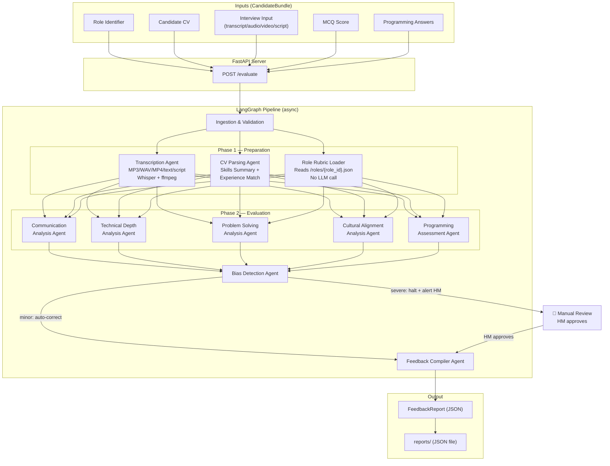
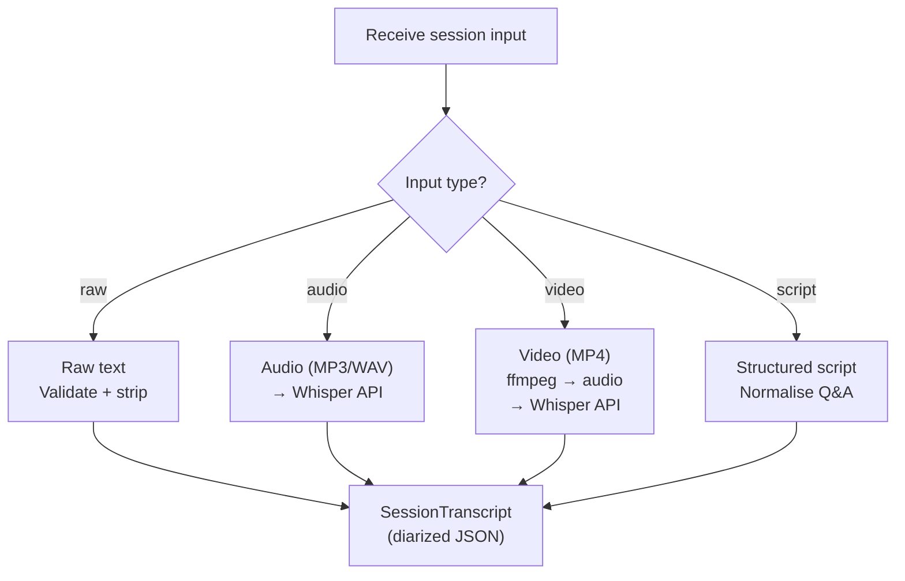
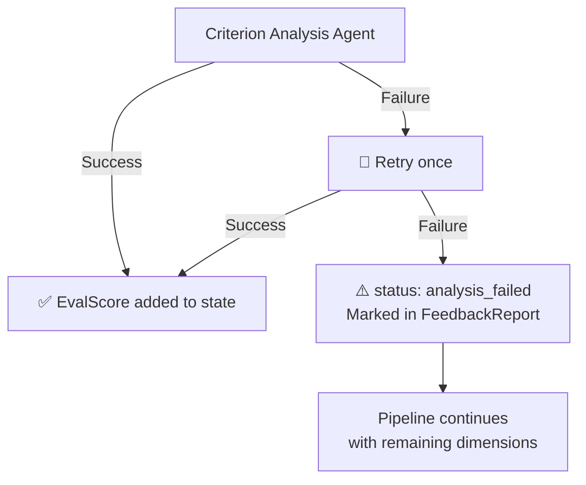

# PRD: AI Interview Feedback System — Phase 1 (MVP)

**Version:** 2.0  
**Status:** Draft — Pending Review  
**Date:** June 2026  
**Authors:** Muhammad Daniyal Farooqui, Shaikh Muhammad Umair  
**Scope:** Internal hiring tool — single organisation

---

## Problem Statement

Hiring teams spend significant time manually writing candidate evaluations after interviews. The process is slow (interviewers delay writing feedback), inconsistent (each interviewer uses a different format and standard), and prone to bias (subjective language; anchoring on candidate background rather than interview performance). There is no standardised way to aggregate feedback across multiple rounds for a single candidate, forcing Hiring Managers to read through unstructured scorecards to piece together a hiring decision.

> **Result:** hiring decisions are delayed, unevenly justified, and difficult to audit or defend.

---

## Solution

Build an internal, automated evaluation pipeline — exposed as a **FastAPI server** — that accepts a candidate's interview materials, pre-interview test results, CV, and a *role identifier*, then uses a multi-agent AI system (LangGraph + GPT-4o mini) to produce a structured **FeedbackReport** containing:

- Per-dimension scores (1–5) with evidence-backed narratives.
- Pre-interview test results (MCQ score + programming quality assessment).
- Strengths and concerns bullets synthesised across all dimensions.
- A weighted AI Recommendation (*Strong Hire / Hire / Maybe / No Hire*).
- A CV Experience Match comparing claimed experience to role requirements.
- A BiasLog documenting any corrected language.

The Hiring Manager reviews the FeedbackReport and records their final decision (*Hired / Rejected / Hold*). **The system is the evaluation engine — the human retains full decision authority.**

---

## High-Level Architecture



---

## Design Principles

### Fixed-Role Catalogue

Evaluation criteria and rubric weights are loaded from a pre-approved, version-controlled JSON file per role stored under `/roles/`. No LLM call is made at runtime to infer rubric weights from a free-text Job Description. This ensures every candidate for the same role is evaluated against *identical* criteria, eliminating inter-JD scoring variance. Adding a new role requires a human to create a new JSON file — a deliberate governance gate.

```
/roles/
  backend_engineer.json
  frontend_engineer.json
  data_scientist.json
  product_manager.json
  devops_engineer.json
```

**Example role file** (`backend_engineer.json`):

```json
{
  "role_id": "backend_engineer",
  "role_name": "Backend Engineer",
  "version": "1.0.0",
  "required_skills": ["Python", "Go", "PostgreSQL", "Kubernetes", "Kafka"],
  "min_experience_years": 3,
  "dimensions": [
    { "name": "Technical Depth",    "weight": 3,
      "definition": "Distributed systems, DB internals, API design, trade-off reasoning." },
    { "name": "Problem Solving",    "weight": 2,
      "definition": "Structured decomposition, edge-case handling, failure-mode reasoning." },
    { "name": "Communication",      "weight": 1,
      "definition": "Clarity, audience calibration, conciseness." },
    { "name": "Cultural Alignment", "weight": 1,
      "definition": "Collaborative mindset, openness to feedback." }
  ]
}
```

### CV Experience Match

The CV Parsing Agent produces a dedicated `ExperienceMatchSummary` alongside the anonymised skills summary. It compares the candidate's CV against the role catalogue's required skills and minimum experience, surfacing required skills present/missing, years of experience vs. the role minimum, and an overall domain relevance rating (`strong / moderate / weak`). The match appears as `cv_experience_match` in the FeedbackReport and is informational only — it does *not* feed into dimension scores.

### Unified Staff Tier

All technical interviewers — regardless of seniority — submit via the same `POST /evaluate` endpoint. Seniority is not passed to any evaluation agent and does not influence scores. If `interviewer_level` is supplied it is stored as read-only audit metadata only. **Only the Hiring Manager may confirm, reject, or place a candidate on hold.**

### Bias-Free Design (Defence in Depth)

1. **Input layer** — All PII (name, gender, age, university, employer) is stripped from the CV before any LLM sees it.
2. **Role layer** — Rubrics are loaded from the curated catalogue; no LLM infers criteria from free-text at runtime.
3. **Evaluation layer** — Scoring is anchored to fixed role criteria, not candidate background.
4. **Output layer** — The Bias Detection Agent scans all generated text, auto-correcting minor issues and halting on severe ones.

---

## User Stories

### Evaluation Pipeline

1. As an Interviewer, I want to submit a candidate's interview material and a role identifier via an API call, so that I receive an AI-generated FeedbackReport without writing one manually.
2. As an Interviewer, I want the system to evaluate Communication, Technical Depth, Problem Solving, and Cultural Alignment as separate scored dimensions.
3. As an Interviewer, I want each dimension score to include a written justification citing specific quotes from the transcript.
4. As an Interviewer, I want to submit multiple interview session transcripts for a single candidate so that the full process is evaluated holistically.
5. As an Interviewer, I want each session to declare which dimensions it covers, so that the Cultural Alignment agent only analyses the HR session.
6. As an Interviewer, I want to submit the candidate's pre-interview MCQ score so that the FeedbackReport includes this objective data point.
7. As an Interviewer, I want to submit the candidate's raw programming answers so that the Programming Assessment Agent evaluates code quality, not just correctness.
8. As an Interviewer, I want to upload the candidate's CV so that the pipeline can compare claimed skills against the role requirements.
9. As an Interviewer, I want to submit any supported input format (raw text, audio, video, or structured script) without manually transcribing recordings first.

### Bias-Free Design

10. As a Hiring Manager, I want candidate PII stripped from the CV before any evaluation agent sees it.
11. As a Hiring Manager, I want all proper nouns and dates removed from the Candidate Skills Summary so that no prestige signals leak into evaluation.
12. As a Hiring Manager, I want the Bias Detection Agent to scan all AI-generated text for gendered pronouns and bias-coded language before I see the FeedbackReport.
13. As a Hiring Manager, I want minor bias-coded language auto-corrected, with the original and replacement logged in the BiasLog.
14. As a Hiring Manager, I want severe bias to halt delivery and alert me to review manually.
15. As a Hiring Manager, I want to view the BiasLog attached to every FeedbackReport.

### Role Catalogue & Rubric

16. As a Hiring Manager, I want evaluation criteria and weights loaded from a pre-approved role JSON file so that all candidates for the same role are scored against identical standards.
17. As a Hiring Manager, I want to introduce a new role by adding a JSON file to the catalogue, so that expansion is deliberate and version-controlled.
18. As a Hiring Manager, I want the weighted scores to drive the AI Recommendation.

### CV Experience Match

19. As a Hiring Manager, I want the FeedbackReport to include a CV Experience Match section showing required skills present/missing, total experience, and an overall match rating.
20. As a Hiring Manager, I want the experience match to compare against the role catalogue's required skills so the comparison is consistent and bias-free.

### FeedbackReport

21. As a Hiring Manager, I want the FeedbackReport to contain strengths bullets synthesised across all dimensions.
22. As a Hiring Manager, I want the FeedbackReport to contain concerns bullets synthesised across all dimensions.
23. As a Hiring Manager, I want the FeedbackReport to include the MCQ Score as a standalone data point.
24. As a Hiring Manager, I want the FeedbackReport to include the Programming Assessment Agent's evaluation of code quality.
25. As a Hiring Manager, I want to record my final decision (Hired / Rejected / Hold) with a timestamp.
26. As a Hiring Manager, I want the AI Recommendation to be advisory only, so that I retain full decision authority and legal responsibility.
27. As a Hiring Manager, I want to be the only person who can confirm or reject a candidate, regardless of the submitter's seniority.

### API & Retrieval

28. As an API consumer, I want to call `POST /evaluate` with a role identifier and CandidateBundle inputs.
29. As an API consumer, I want the `POST /evaluate` response to return the complete FeedbackReport as JSON.
30. As an API consumer, I want to call `GET /report/{id}` to retrieve a previously generated FeedbackReport.
31. As an API consumer, I want to call `PATCH /report/{id}/decision` to record the Hiring Manager's final decision.

### Failure Handling

32. As an Interviewer, I want the pipeline to automatically retry a failed Criterion Analysis Agent once before giving up.
33. As an Interviewer, I want the FeedbackReport to still be generated even if one criterion fails, with a clear `[Analysis Failed — Please Review Manually]` marker.
34. As an Interviewer, I want the pipeline to validate all required CandidateBundle inputs before any agent runs.

### Debug & Audit

35. As a developer, I want a `--debug` mode that persists the intermediate Candidate Skills Summary to a file.
36. As a developer, I want the FeedbackReport JSON to include a `pipeline_version` field.
37. As a developer, I want the FeedbackReport JSON to include start/end timestamps.
38. As a developer, I want the BiasLog to record every correction as a structured object (original phrase, corrected phrase, reason, severity).

---

## Implementation Decisions

### 1. Multi-Agent Pipeline (LangGraph DAG)

The evaluation pipeline is a directed acyclic graph (DAG) implemented in LangGraph with fully async execution. Agents are nodes; edges define execution order and parallelism. The diagram below shows the complete execution flow including both parallel phases, bias routing, and the manual review path for severe bias findings.

*(See Pipeline DAG diagram in High-Level Architecture section above.)*

### 2. Transcription Agent — Input Routing

The Transcription Agent accepts four input types and normalises all of them into a `SessionTranscript` (diarized JSON):



### 3. Failure Strategy

The Orchestrator retries any failed Criterion Analysis Agent once. On a second failure the dimension is marked `analysis_failed` in the FeedbackReport and the pipeline continues without aborting. Each LLM-backed agent also enforces a configurable `max_tokens` cap to prevent runaway cost and latency. If any agent call fails — whether due to an API error, malformed output, or token limit — the same retry logic applies.



### 4. Shared Pipeline State — InterviewState

All agents read from and write to a single `InterviewState` (Pydantic model). State accumulates as each node completes:

| Field | Written by | Type |
|---|---|---|
| `id` | Orchestrator | `string (UUID)` |
| `pipeline_version` | Orchestrator | `string` |
| `started_at` / `completed_at` | Orchestrator | `datetime` |
| `role_id` | Ingestion | `string` |
| `rubric` | Role Rubric Loader | `Rubric` |
| `raw_cv` | Ingestion | `str` |
| `transcripts` | Ingestion / Transcription Agent | `list[SessionTranscript]` |
| `mcq_score` | Ingestion | `float` |
| `programming_answers` | Ingestion | `list[str]` |
| `candidate_skills_summary` | CV Parsing Agent | `CandidateSkillsSummary` |
| `cv_experience_match` | CV Parsing Agent | `ExperienceMatchSummary` |
| `eval_results` | Criterion Analysis Agents | `dict[str, EvalScore]` |
| `programming_eval` | Programming Assessment Agent | `EvalScore` |
| `bias_log` | Bias Detection Agent | `BiasLog` |
| `feedback_report` | Feedback Compiler Agent | `FeedbackReport` |

### 5. Agent Input/Output Contracts

| Agent | Inputs | Output |
|---|---|---|
| **Transcription Agent** | Interview Recording (audio/video) or raw text | `SessionTranscript` (diarized JSON) |
| **CV Parsing Agent** | Raw CV text, Role catalogue | `CandidateSkillsSummary` + `ExperienceMatchSummary`. Zero PII. |
| **Role Rubric Loader** | `role_id` | `Rubric` (from `/roles/{role_id}.json`). No LLM call. |
| **Criterion Analysis Agent (×4)** | Single dimension definition, transcript(s), Candidate Skills Summary | `EvalScore` — score (1–5), justification, evidence quotes |
| **Programming Assessment Agent** | Programming Answers, Rubric definition | `EvalScore` — score (1–5), justification, code-level evidence |
| **Bias Detection Agent** | All justification + evidence text from evaluation agents | `BiasLog` — corrections list, severity, bias_detected flag |
| **Feedback Compiler Agent** | All EvalScores, MCQ Score, Programming eval, BiasLog, Experience Match | `FeedbackReport` — complete structured output |

### 6. Anonymisation Rules (CV Parsing Agent)

The CV Parsing Agent applies **strict anonymisation** before any data reaches evaluation agents:

| Category | Action | Example |
|---|---|---|
| Personal names | Strip | "Rahul Ahmed" → removed |
| Employer names | Strip | "at Google" → removed |
| Institution names | Strip | "IIT Bombay" → removed; "MSc Computer Science" → kept |
| Project/product names | Genericise | "Contributed to TensorFlow" → "Open-source ML framework contributor" |
| Dates and years | Convert to durations | "2018–2023" → "5 years" |
| City/country names | Strip | "Based in Bangalore" → removed |
| GPA/class/rank | Strip | "First class honours" → removed |
| Hobbies/activities | Strip | Removed entirely |
| Technical skills | Keep | "Python, Kubernetes, React" → kept |
| Achievement metrics | Keep | "Serving 10M req/day" → kept |

### 7. Bias Detection — Language Patterns

| Flagged Pattern | Severity | Action | Neutral Replacement |
|---|---|---|---|
| Gendered pronouns (he/she/his/her) | Minor | Auto-correct | "the candidate" / "they/their" |
| "aggressive" | Minor | Auto-correct | "assertive" / "direct" |
| "abrasive" | Minor | Auto-correct | "candid" / "forthright" |
| "articulate" (with surprise tone) | Minor | Auto-correct | "communicated clearly" |
| "emotional" | Minor | Auto-correct | "expressive" / "passionate" |
| "timid" | Minor | Auto-correct | "measured" / "considered" |
| Nationality / ethnicity references | Severe | Halt + alert | — |
| Religion / caste references | Severe | Halt + alert | — |
| Accent / language proficiency commentary | Severe | Halt + alert | — |
| Age references | Severe | Halt + alert | — |

### 8. ExperienceMatchSummary Schema

```json
{
  "required_skills_present":  ["Python", "Kubernetes", "PostgreSQL"],
  "required_skills_missing":  ["Go", "Kafka"],
  "years_of_experience":      "5 years",
  "role_min_experience":      "3 years",
  "domain_match":             "moderate",
  "overall_match_rating":     "strong"
}
```

### 9. Permission Model (Phase 1)

| Action | Interviewer | Tech Staff | Hiring Mgr |
|---|---|---|---|
| Submit evaluation (`POST /evaluate`) | ✅ | ✅ | ✅ |
| View report (`GET /report/{id}`) | ✅ | ✅ | ✅ |
| Set final decision (`PATCH /decision`) | ❌ | ❌ | ✅ |
| Add new role JSON to catalogue | ❌ | ❌ | ✅ |

> **Note:** Full RBAC (authentication, SSO, per-endpoint guards) is deferred to Phase 2. In Phase 1 the model above is enforced by convention.

### 10. Tech Stack

| Layer | Technology | Rationale |
|---|---|---|
| Language | Python 3.11 | Stable LangGraph/FastAPI/OpenAI SDK |
| Package manager | uv | Fast pip-replacement, `pyproject.toml` |
| Web framework | FastAPI (async) | Async-native, Pydantic integration |
| Pipeline orchestration | LangGraph | Stateful DAG, parallel branches |
| LLM (text) | GPT-4o mini (AsyncOpenAI) | Cost-effective, provider-agnostic |
| LLM (speech-to-text) | Whisper API | Audio/video transcription |
| Audio extraction | ffmpeg | MP4 → audio before Whisper |
| Data models | Pydantic v2 | Runtime validation, OpenAPI schema |
| Role config | JSON files (`/roles/`) | Version-controlled, human-governed |
| Report storage | JSON files (`/reports/`) | Zero-infrastructure MVP |
| Secrets | .env + python-dotenv | Standard local dev secrets |
| Testing | pytest + pytest-asyncio + httpx | Async pipeline + endpoint tests |
| Execution model | Fully async | True concurrent LLM calls |

---

## Output Format — Candidate Feedback Report

The unified feedback report contains the following sections. The Hiring Manager may edit AI-generated fields before recording a final decision.

| Section | Content | Editable by HM? |
|---|---|---|
| Candidate Header | Name, role applied for, interview date, interviewer names | No |
| Test Performance | MCQ score, programming Q1 score, programming Q2 score (all /5) | No |
| Communication | Score 1–5 + 2 sentence justification | Yes |
| Technical Depth | Score 1–5 + 2 sentence justification | Yes |
| Problem Solving | Score 1–5 + 2 sentence justification | Yes |
| Cultural Alignment | Score 1–5 + 2 sentence justification (from Session 2) | Yes |
| Strengths | 2–3 bullet points | Yes |
| Concerns | 2–3 bullet points | Yes |
| AI Recommendation | Strong Hire / Hire / Maybe / No Hire + 1 sentence justification | Yes |
| Final Decision | Hired / Rejected / Hold — submitted by Hiring Manager | Yes (required) |

> **Note:** The AI Recommendation and all dimension scores are editable to allow the Hiring Manager to correct any AI misjudgement before the report is finalised. The Final Decision field is mandatory and constitutes the only legally binding output of the system.

---

## Test Strategy per Agent

| Agent | Test Type | Key Test Cases |
|---|---|---|
| Ingestion Agent | Unit + Integration | Valid bundle accepted; missing input rejected; diarization output structure validated |
| Communication Agent | Unit | Returns score 1–5; justification non-empty; role rubric applied correctly |
| Technical Depth Agent | Unit | SWE vs AI rubric applied correctly; programming answer scored on logic not syntax only |
| Problem Solving Agent | Unit | Structured thinking detected; edge case awareness scored |
| Cultural Alignment Agent | Unit | Session 2 transcript used exclusively; HR rubric applied |
| Bias Detection Agent | Unit | Loaded language flagged; demographic signals detected; clean output passes through unchanged |
| Feedback Compiler Agent | Integration | All five scores present; narrative sections populated; recommendation enum valid |
| Reviewer Interface | E2E | Report renders correctly; edit persists; submission records to DB with timestamp |

---

## Known Risks & Mitigations

| Risk | Likelihood | Mitigation |
|---|---|---|
| Vague rubrics produce confidently wrong feedback | High | Define explicit scoring criteria per dimension per role before implementation begins |
| Long transcripts exceed Smart Zone (~100k tokens) | Medium | Chunk transcripts before agent processing; summarize per speaker turn |
| Bias Detection Agent misses subtle bias | Medium | Maintain a test suite of known biased phrases; iterate rubric over time |
| Digital test migration faces internal resistance | Low | Frame as quality improvement; paper scores introduce human error and delay |
| Hiring manager ignores AI recommendation entirely | Low | Expected and acceptable — system is advisory, not decisional |
| Legal challenge to AI-assisted hiring decision | Low | All decisions submitted by human; AI output is clearly labelled as draft |

---

## Further Notes

### Provider-Agnostic LLM Abstraction

While the MVP uses GPT-4o mini exclusively, the LLM client sits behind an abstraction layer. This enables A/B testing across providers, cost optimisation by routing different agents to different models, and Phase 2 migration to multimodal models.

### The Hiring Manager Decision is the Only Legally Binding Output

The AI Recommendation is advisory. The `hiring_manager_decision` field — set to *Hired*, *Rejected*, or *Hold* by a human via `PATCH /report/{id}/decision` — is the only output that carries legal and operational weight. No other role may set this field in Phase 1.
